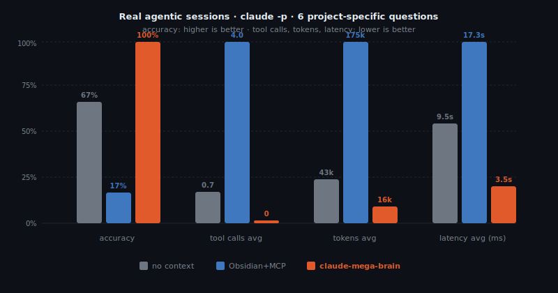

<div align="center">


# claude-mega-brain

*Loads the knowledge. Skips the search.*

[](https://github.com/guhcostan/claude-mega-brain/actions)
[](https://github.com/guhcostan/claude-mega-brain)
[](https://github.com/guhcostan/claude-mega-brain/releases)
[](LICENSE)
[](https://github.com/anthropics/claude-code)

**100% accuracy · 0 tool calls · −91% tokens vs Obsidian+MCP**

Real agentic sessions. [Benchmark →](benchmarks/results/agentic-obsidian-vs-mega-brain.md)

</div>

---

## Install

```
/plugin marketplace add guhcostan/claude-mega-brain
/plugin install mega-brain@guhcostan
```

Then in any project:

```
/mega-brain:init
```

Start a new session — the knowledge base loads automatically.

---

## The problem

Without claude-mega-brain, Claude guesses from training data:

```
User: What column stores the order total?

Claude (no context): Typically total_amount (DECIMAL) or amount (FLOAT)...
# Wrong — this project uses amount_cents (INT64)
```

With claude-mega-brain, the exact schema is injected at `SessionStart`:

```
<mega-brain>
Knowledge: 4 documented concepts found in project

  docs/orders.md     [BigQuery Table] — amount_cents INT64, status STRING(pending/confirmed/shipped/done)
  docs/customers.md  [BigQuery Table] — customer_id STRING, email STRING
  docs/wau.md        [Metric]         — COUNT(DISTINCT user_id) WHERE session_date >= CURRENT_DATE-7
  docs/net_revenue.md [Metric]        — SUM(amount_cents - refund_cents)/100 WHERE status='done'
</mega-brain>

User: What column stores the order total?

Claude: amount_cents (INT64) — from docs/orders.md
# Correct. 0 tool calls. First turn.
```

---

## Benchmark

6 questions with project-specific values unknowable from training data.
Real agentic sessions — not simulated.



| metric | no context | Obsidian+MCP | **claude-mega-brain** |
|---|--:|--:|--:|
| accuracy | 67% | 17–83%* | **100%** |
| tool calls avg | 0.7 | 0.7–4.0 | **0** |
| tokens avg | 42,519 | 42k–175k | **16,025** |
| latency avg ms | 9,508 | 8k–17k | **3,983** |

\* Obsidian+MCP accuracy varies by run — the vault lacks exact schema values so the model oscillates between guessing (fast, unreliable) and exploring (slow, still misses). mega-brain is stable across runs.

Obsidian+MCP makes 4 tool calls per question, reads the vault, and still misses — because prose notes lack exact schema values. claude-mega-brain injects structured OKF once at `SessionStart` and answers in a single turn with zero exploration.

[Full results](benchmarks/results/agentic-obsidian-vs-mega-brain.md) · [Reproduce](benchmarks/)

---

## How it works

At `SessionStart`, a hook scans the entire project for any `.md` file with `type:` in its YAML frontmatter and injects a compact index:

```
<mega-brain>
Knowledge: 8 documented concepts found in project

Recent (log.md):
  2026-06-29 — added customers table

  index.md            [Index]         — Central reference for all sales data
  docs/orders.md      [BigQuery Table] — One row per completed order
  docs/customers.md   [BigQuery Table] — Customer profiles
  docs/wau.md         [Metric]         — Weekly active users
  ...
</mega-brain>
```

No dedicated folder needed — documents can live anywhere in the project. When Claude reads an OKF file, linked concepts surface automatically via `PostToolUse`.

**Zero overhead when not in use** — if no documented concepts are found, the hook exits in <5ms.

---

## How it compares

| tool | auto-inject | schema enforcement | tool calls to answer |
|------|-------------|-------------------|---------------------|
| **claude-mega-brain** | ✓ SessionStart hook | required (`type:`) | **0** |
| Obsidian + MCP | ✗ manual | none | 4+ |
| Notion | ✗ manual | proprietary | N/A |
| Logseq | ✗ plugin-based | none | N/A |
| mem.ai | ✗ none | none | N/A |

---

## OKF Format

Any `.md` file in the project with `type:` in its YAML frontmatter is automatically picked up. No dedicated folder needed.

```markdown
---
type: BigQuery Table
title: Orders
description: One row per completed customer order.
resource: https://console.cloud.google.com/bigquery?p=acme&d=sales&t=orders
tags: [sales, revenue]
timestamp: 2026-06-29T00:00:00Z
---

# Schema
| Column      | Type      | Description              |
|-------------|-----------|--------------------------|
| order_id    | STRING    | Globally unique order ID |
| customer_id | STRING    | FK → customers           |
| amount_cents| INT64     | Total in cents           |
| status      | STRING    | pending/confirmed/shipped/done |

# Joins
Joined with [customers](customers.md) on `customer_id`.
```

### Reserved files

| File | Purpose |
|------|---------|
| `index.md` (with `type: Index`) | Knowledge map — Claude reads this first |
| `log.md` (with `type: Log`) | Append-only changelog — last 3 entries injected at session start |

### Common types

`BigQuery Table` · `BigQuery Dataset` · `Table` · `Metric` · `API` · `Runbook` · `Concept` · `Service` · `Pipeline`

Types are freeform — add your own.

---

## Usage

### Start from scratch

```
/mega-brain:init
```

Creates `index.md` and `log.md` anywhere you want. Start a new session — context injects automatically.

### Migrate existing docs

```
/mega-brain:migrate
```

Scans `openapi.yaml`, `schema.prisma`, `schema.sql`, `docs/`, `README` sections and adds `type:` frontmatter to generate OKF concepts.

### Add a single concept

```
/mega-brain:ingest
```

Document a specific table, metric, API, or service. Saves the file wherever makes sense for your project structure.

---

## Installation

### Claude Code

```
/plugin marketplace add guhcostan/claude-mega-brain
/plugin install mega-brain@guhcostan
```

### Local development

```bash
claude plugin install /path/to/claude-mega-brain
```

---

## Config (`.mega-brain.json`)

Optional per-project overrides:

```json
{
  "dir": "knowledge",
  "maxConcepts": 100,
  "priorityTypes": ["Metric", "BigQuery Table"]
}
```

| Field | Default | Description |
|-------|---------|-------------|
| `maxConcepts` | `60` | Max concepts in injected index |
| `priorityTypes` | `[]` | Types shown at top of index |
| `exclude` | `[]` | Additional dirs to skip when scanning |

---

## FAQ

**Does it slow down every session?**
No. If no OKF directory exists, the hook exits in <5ms with no context injected.

**Can I use it with an existing wiki or docs folder?**
Add `type:` YAML frontmatter to any Markdown file and drop it in your OKF dir. Done.

**What if I have 500 concepts?**
Set `maxConcepts` in `.mega-brain.json`. The index stays compact; `index.md` holds the full map.

---

## References

- [Open Knowledge Format — Google Cloud](https://cloud.google.com/blog/products/data-analytics/how-the-open-knowledge-format-can-improve-data-sharing)
- [LLM Wiki pattern — Andrej Karpathy](https://gist.github.com/karpathy/442a6bf555914893e9891c11519de94f)
- [Mega Brain — Thiago Finch](https://www.instagram.com/reel/DZI-ys4h29A/) — the meme this plugin is named after

---

## Star History

[](https://star-history.com/#guhcostan/claude-mega-brain&Date)

---

## License

[MIT](LICENSE) — The shortest license that works.
